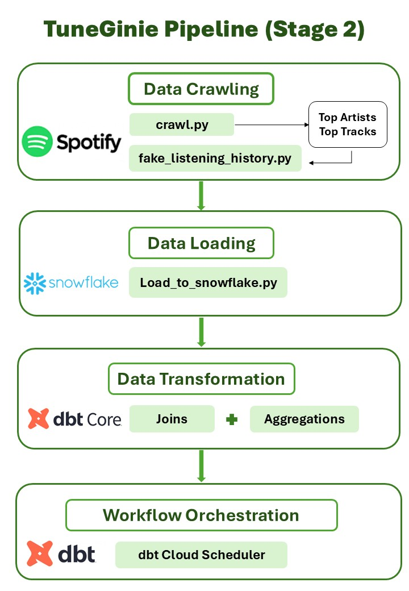

# **TuneGenie – Spotify Playlist Recommender & Analyzer** 🎧  

Welcome to my Spotify ELT Pipeline repository! 🎶

As both a data enthusiast and a daily Spotify listener, I created this project to explore the capabilities of modern data platforms through the lens of music analytics. My goal was to understand how real-time data can be harnessed to generate meaningful insights and build intelligent applications, particularly in the context of personalized music experiences.

This project demonstrates a fully automated, cloud-based ELT pipeline that ingests real-time data from the Spotify API and processes it end-to-end. Key components include data extraction, synthetic data generation, loading into Snowflake, and data transformation via SQL using dbt Cloud. The pipeline culminates in machine learning modeling and an interactive AI chatbot, enabling both recommendation system development and rich analytical exploration — all orchestrated seamlessly through modern data tooling.

---

## 📑 Table of Contents  
1. [Architecture Diagram](#architecture-diagram)  
2. [Project Components](#project-components)  
3. [Getting Started](#getting-started)  

---

## Architecture Diagram  

---

## Project Components  

**1. Data Extraction**

Extract Spotify data using a Python script (`crawl.py`) from:

- Artists metadata
- Track metadata
- Synthetic data of listening history

**2. Synthetic Data Generation**

Generate realistic listening history data using fake_listening_history.py to simulate user behavior patterns:

- User listening sessions
- Play counts and timestamps
- User preferences simulation
- Interaction patterns modeling

**3. Data Loading**

Raw structured data is loaded into **Snowflake**’s **Raw Data Layer**, enabling scalable, cloud-based storage and analysis.

**4. Data Transformation**

Using dbt Core, the data is cleaned and enriched:

- Deduplication, null handling
- Type casting & encoding
- Feature enrichment (e.g., audio stats, genre behavior)
- Playlist trend analysis and genre clustering

**5. Machine Learning Model**

Simple ML model implementation for music analytics and pattern recognition in the processed data.

**6. Workflow Orchestration**

Using dbt Cloud, the pipeline is scheduled and automated with:

- Job scheduling with cron-based execution and custom schedules
- Event-driven execution triggered by job completion or API calls
- Built-in CI/CD deployment and monitoring capabilities
- Automated testing and documentation generationn

**7. AI Chatbot Interface**

Interactive chatbot system that allows users to:

- Query music information
- Explore listening patterns
- Ask questions about existing music data
- Content-based and collaborative filtering recommendations

---

## Getting Started  

### Prerequisites  

- Python 3.8+
- Spotify Developer Credentials
- Snowflake Account
- Airflow (installed locally or via Docker)
- Python packages: `requests`, `pandas`, `snowflake-connector-python`, `spotipy`, etc.
